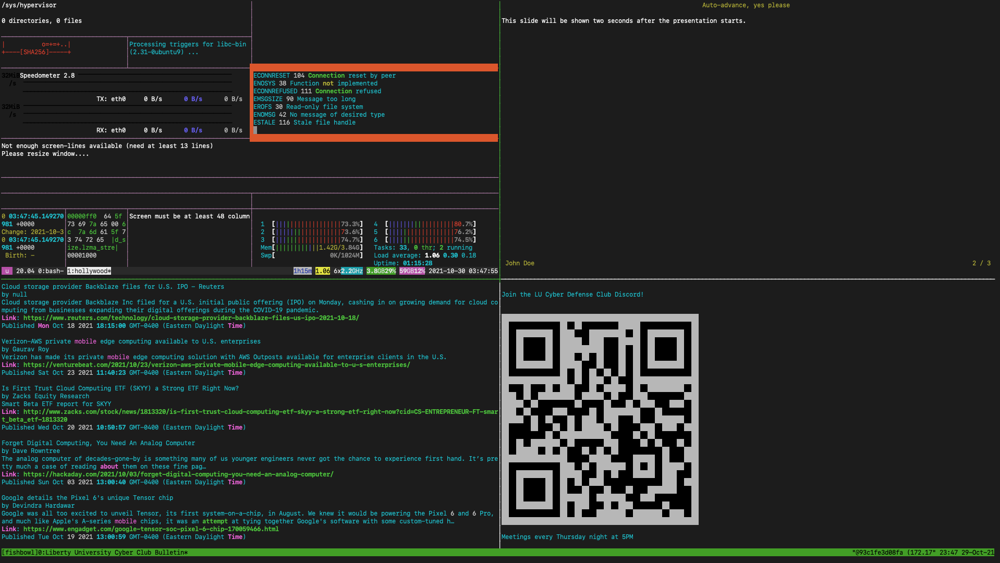

# fishbowl

fishbowl is your super duper coolio hacker kiosk display.



fishbowl allows you to display [hollywood](https://github.com/dustinkirkland/hollywood), a markdown textual based powerpoint display using [patat](https://github.com/jaspervdj/patat), a listing of all the top news headlines using [clinews](https://github.com/shogunpurple/clinews), and a QR Code for some information using [qrcode-terminal](https://github.com/gtanner/qrcode-terminal).

It then displays all of this information using tmux to take advantage of all of your juicy screen real estate.

## Requirements

To use this setup effectively, you need a self hosted runner with ```ansible``` and the ```community.general``` collection installed.

You then need to define your appropriate secrets such as your news api key, ansible become password, and QR code link.

Then push to your cloned repository and watch the magic happen.

## Updating

Anytime you need to update information, just change the files in the repository and push.  The ansible will copy over the updated files, and all of the displays will be updated seamlessly.

The news feed is refreshed every night to ensure no api key overuse occurs.
